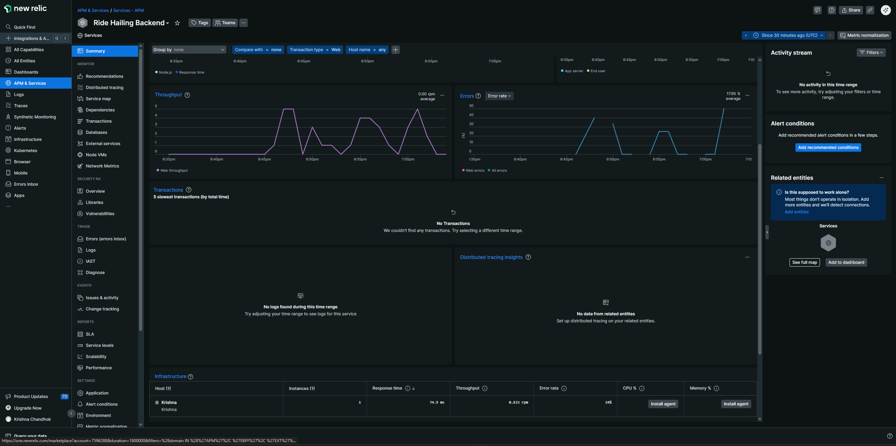
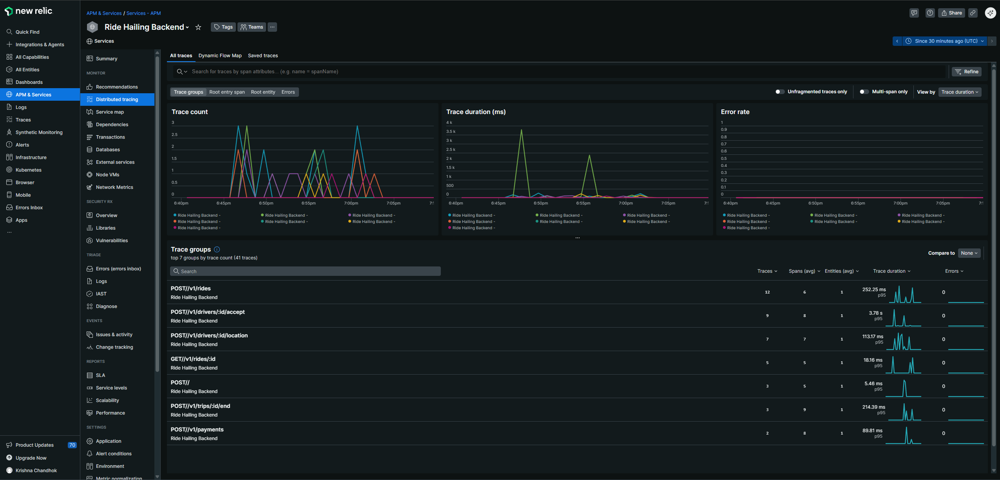
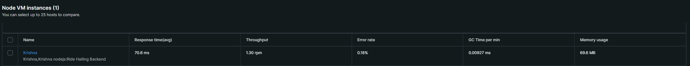

# 🚕 Ride Hailing System  
**Backend-First | Strong Consistency | Production Observability**

A simplified yet **production-oriented ride hailing system** inspired by Uber and Ola.  
This project focuses on **backend correctness, transactional safety, scalability, and observability**, with a minimal frontend used only to visualize backend state transitions.

> ⚠️ UI is intentionally simple. Backend correctness is the goal.

---

## 📌 Key Objectives

- Correct backend system design
- Strong consistency under concurrency
- Low-latency API handling
- Transaction-safe state transitions
- Production-grade observability (APM)
- Clear, readable architecture for engineers

---

## 📂 Repository Structure

```
.
├── backend/                 # NestJS backend (source of truth)
├── frontend/                # React (Vite) frontend
├── docs/                    # Documentation & screenshots
│   └── newrelic/             # New Relic APM screenshots
└── README.md
```

---

## 🧱 Tech Stack

### Backend
- Node.js
- NestJS
- PostgreSQL
- Redis
- TypeORM
- New Relic APM

### Frontend
- React (Vite)
- Axios
- Polling-based live updates

---

## 🏗 High-Level System Flow

1. Drivers send periodic location updates  
2. Riders create ride requests  
3. Matching service assigns a driver transactionally  
4. Trips are created and tracked  
5. Trips are completed and payments are processed  
6. Drivers become available again  

➡️ **All business logic is enforced server-side**  
➡️ Frontend never assumes state

---

## 🧠 Backend Design Overview

### Core Services

| Service | Responsibility |
|------|----------------|
| Rides Service | Ride creation & lifecycle |
| Drivers Service | Driver availability & location |
| Matching Service | Driver–ride assignment (transactional) |
| Trips Service | Trip lifecycle & fare calculation |
| Payments Service | Payment processing (mocked PSP) |

---

## 🗄 Data Stores

### PostgreSQL (Source of Truth)
- Strong consistency
- ACID transactions
- Row-level locking
- Uniqueness constraints

### Redis (Read Optimization Only)
- Driver location cache
- Driver availability cache
- Ride status cache  
🚫 Never used as source of truth

---

## 🔄 State Machines

### Driver State
```
AVAILABLE → ON_TRIP → AVAILABLE
```

### Ride State
```
MATCHING → ASSIGNED
```

### Trip State
```
CREATED → COMPLETED
```

---

## 🔐 Consistency & Concurrency Guarantees

- Database transactions
- Row-level pessimistic locks
- Database uniqueness constraints

Guarantees:
- One active trip per driver
- One driver per ride
- No double assignment under concurrency

---

## 🔁 Idempotency

All write APIs support **Idempotency Keys** to prevent:
- Duplicate ride creation
- Duplicate driver acceptance
- Duplicate payments

---

## 🔌 API Summary

| Method | Endpoint | Description |
|------|---------|-------------|
| POST | /v1/rides | Create a new ride |
| GET  | /v1/rides/:id | Get ride status |
| POST | /v1/drivers/:id/location | Update driver location |
| POST | /v1/drivers/:id/accept | Accept a ride |
| POST | /v1/trips/:id/end | End trip |
| POST | /v1/payments | Process payment |

---

## 📊 Observability & Performance (New Relic APM)

The backend is instrumented using **New Relic APM** to observe real production-like behavior.

### What is Monitored
- API latency (avg, p95)
- Throughput (requests per minute)
- Error rates
- Distributed traces
- Database & Node.js runtime metrics

### New Relic Dashboards







### Observations
- Stable response times under repeated API calls
- No error spikes during concurrency tests
- Indexed queries avoid table scans
- Redis reduces database read pressure
- Clean distributed traces across services

---

## ▶️ Running the Project Locally

### Prerequisites
- Node.js >= 18
- PostgreSQL
- Docker (for Redis)
- New Relic account (free tier)

---

## 🧩 Backend Setup

### 1. Install Dependencies
```bash
cd backend
npm install
```

### 2. Backend Environment Variables

Create `backend/.env`:

```env
PORT=3000
NODE_ENV=development

DB_HOST=
DB_PORT=
DB_USERNAME=
DB_PASSWORD=
DB_NAME=

REDIS_HOST=
REDIS_PORT=

NEW_RELIC_APP_NAME=
NEW_RELIC_LICENSE_KEY=YOUR_NEW_RELIC_LICENSE_KEY
NEW_RELIC_NO_CONFIG_FILE=true
NEW_RELIC_DISTRIBUTED_TRACING_ENABLED=true
NEW_RELIC_LOG_ENABLED=true
```

⚠️ **Never commit `.env` files to GitHub**

---

### 3. Start Redis
```bash
docker run -d --name redis -p 6379:6379 redis
```

### 4. Start Backend
```bash
npm run start:dev
```

Backend runs at:
```
http://127.0.0.1:3000
```

---

## 🖥 Frontend Setup

### 1. Install Dependencies
```bash
cd frontend
npm install
```

### 2. Frontend Environment Variables (Recommended)

Create `frontend/.env`:

```env
VITE_API_BASE_URL=http://127.0.0.1:3000/v1
```

### 3. Start Frontend
```bash
npm run dev
```

Frontend runs at:
```
http://localhost:5173
```

---

## 🎯 Frontend Demo Flow

The frontend is intentionally minimal and only visualizes backend state transitions.

1. Create Ride  
2. Send Driver Location  
3. Accept Ride  
4. Observe live status updates  
5. End Trip (payment processed)

---

## 🧭 Design Principles Followed

- Backend is the single source of truth
- Transactions protect critical state
- Redis is used only for hot paths
- Explicit state machines
- Observability is not optional

---

## 📌 Conclusion

This project demonstrates how a **real-world ride hailing backend** can be built with:
- Clear service boundaries
- Strong consistency guarantees
- Concurrency-safe flows
- Production-grade observability

The system is intentionally simple yet representative of real backend challenges.
